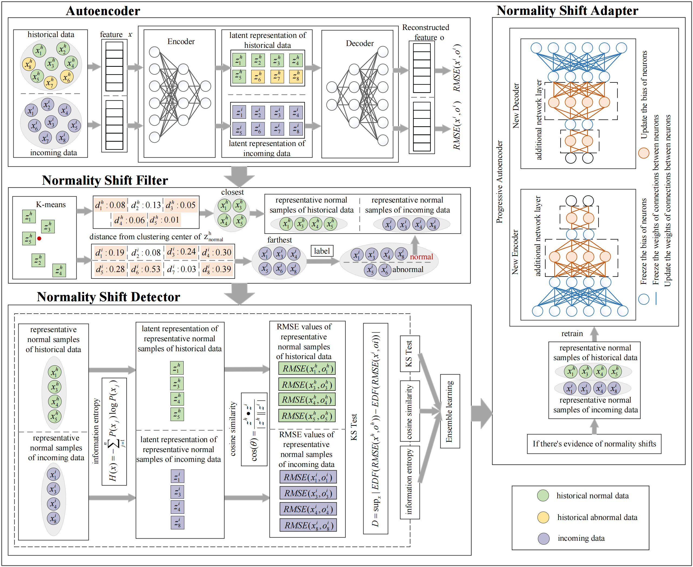

# Anomaly Detection under Normality-Shifted IoT Scenario: Filter, Detection, and Adaption

Learning-based anomaly detection methods train models using normal data samples to capture normal behavioral patterns for identifying anomalies.
However, normal data distribution in IoT environments can shift due to device upgrades and security patch implementations, rendering most anomaly detection research based on the closed-world assumption ineffective in the open world.
Moreover, current approaches fail to effectively exclude anomalies during the detection phase, leading to significantly distorted conclusions, and do not substantially reduce labeling costs during the adaptation phase.

## Introducing NSFDA

Our work introduces a novel Normality Shifts Filter, Detector, and Adapter (NSFDA) method, this method is comprised of a Normality Shift Filter, Normality Shift Detector, and Normality Shift Adapter, with the overall workflow illustrated in the Figure \ref{fig:overview}.

1. **Normality Shift Filter**: The Normality Shift Filter first leverages the latent space representations extracted by the encoder of a pre-trained AE to delve into the core features of the data. It then employs a k-means clustering approach to select representative samples, thereby substantially reducing the cost associated with data labeling.

2. **Normality Shift Detector**: Challenging the conventional research paradigms, the representative normal data samples identified by the Normality Shift Filter are fed into the Normality Shift Detector to ensure accuracy in targeting normality shifts for study. Moreover, we have devised a three-dimensional integrated strategy for the anomaly detection process, custom-tailoring the Normality Shift Detector for comprehensive and precise identification of normality shifts.

3. **Normality Shift Adapter**: We develop a progressive neural network model for the Normality Shift Adapter, which adapts to normality shifts in incoming data by adding new network layers while freezing the parameters of existing layers to preserve valuable knowledge learned from historical data, thus preventing catastrophic forgetting.

The flowchart of NSFDA is as follows.

## Experimental Validation
overview
We have rigorously tested our method using the Kyoto 2006+ dataset to validate the efficacy of the NSFDA method in addressing the normality shift problem in anomaly detection. 

## Model Architecture

Below is the schematic representation of the NSFDA model:

*For detailed information, methodologies, and specific experiment results, we encourage readers to consult our paper.*
